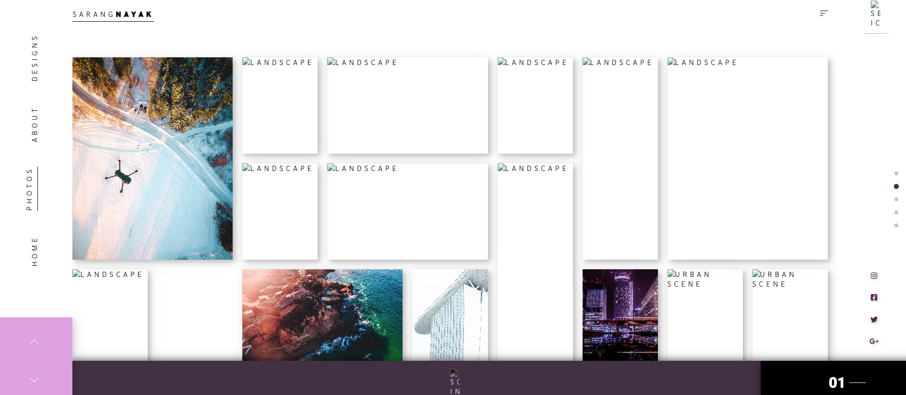

# 🖼️ Selected Works Gallery

[](LICENSE)  
  
  
  


---

## 🌐 Live Demo  
🔗 [View Gallery](https://sarangnayak.github.io/Selected-works/)

---

## 🖼️ Preview  
  

---

## ✨ About  
**Selected Works Gallery** is a curated showcase of photography and visual works, divided into sections such as Portraits, Landscapes, Urban, Nature, and Abstract.  
It provides a clean, grid-based layout that allows the imagery to speak for itself.

---

## 🛠️ Features  
- 📂 Category-based organization (Portraits, Landscapes, Urban, Nature, Abstract)  
- 📐 Responsive grid layout for all device sizes  
- 🖼️ Large preview images with captions (if implemented)  
- 🎨 Minimal UI to keep focus on the artwork  
- ⚙️ Easy to update or extend with more categories and images  

---

## 📂 Folder Structure  

```
Selected-Works/
│
├── index.html           # Main gallery page
├── style.css            # Styling & layout
├── script.js            # (Optional) interactivity, filtering, lightbox
└── assets/              # Images, icons, screenshots
└── preview.png      # Screenshot for README

```
---

## 🚀 Getting Started  
1. Clone the repository:  
   ```bash
   git clone https://github.com/sarangnayak/Selected-Works.git
   cd Selected-Works
   ```
   2. Open index.html in your browser (or host on GitHub Pages)
   3. Replace or add images in the assets/ folder as needed
   4. Customize styling (CSS) or interactivity (script.js) if needed
 --- 
   💡 Customization Ideas
	•	Add filter buttons so users can toggle between categories
	•	Implement a lightbox or modal to view larger versions of images
	•	Add lazy-loading for performance when many images exist
	•	Add hover animations or entrance effects using CSS or a JS library
	•	Add captions or metadata (date, camera info) for each image
	
---

🤝 Contributing

Contributions are welcome!
	•	Fork the repo
	•	Create a new branch (git checkout -b feature/YourFeature)
	•	Make your changes and test thoroughly
	•	Open a Pull Request
---
📜 License

Distributed under the MIT License.
See the LICENSE file for details.

⸻

👤 Author

Sarang Nayak
🔗 GitHub
🌐 Portfolio
---

⭐ If you enjoy exploring this gallery, please give the repo a star!
---

If you like, I can **generate a screenshot mockup** of your gallery (desktop + mobile) so you can save it into `image1.png` and have a polished preview in your README. Would you like me to do that?
